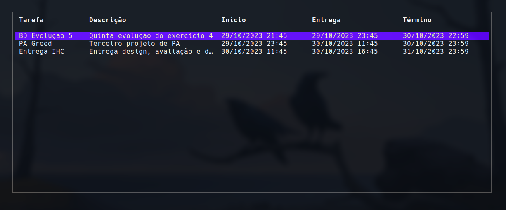

# TUI-TODO
- **Número da Lista**: 19
- **Conteúdo da Disciplina**: Greed

## Alunos

|Matrícula  | Aluno |
| -- | -- |
| 211063069 | Breno Queiroz Lima |

## Sobre 

Um simples TUDO, que utiliza interval scheduling para organizar as tarefas.

## Screenshots




## Instalação 
- **Linguagem**: Go

``` sh
go run .
```

## Uso 

Ctrl+c para sair
Ctrl+n para adicionar uma nova tarefa.
Ctrl+p para selecionar o input anterior.
Ctrl+n para selecionar o próximo input.
